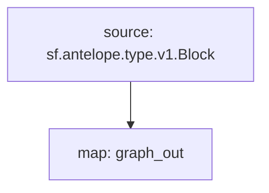

# Subgraph: `Antelope Blocks`

> Full history blocks
>
> WAX, EOS, Ultra, Telos...
> [`sf.antelope.type.v1.Block`](https://buf.build/pinax/firehose-antelope/docs/main:sf.antelope.type.v1)

- [x] **Blocks**

## Chains

- **API Key**: https://thegraph.com/studio/apikeys/
- **Base URL**: https://gateway.thegraph.com/api
- **Subgraph ID**:
  - `4HGGrx3dn8nNc96sBu7QHgsfsncLQ63xpt2hX1ANrsGs`
  - `22046052439585843297187855688343744605992686582964857290586361712542177860664`
- **Query URL format**: `{base_url}`/api/`{api-key}`/subgraphs/id/`{subgraph_id}`

| Chain | Subgraph ID |
| ----- | ----------- |
| WAX   | [`??`](https://thegraph.com/explorer/subgraphs/???view=Query&chain=arbitrum-one) |
| EOS   | [`4HGGrx3dn8nNc96sBu7QHgsfsncLQ63xpt2hX1ANrsGs`](https://thegraph.com/explorer/subgraphs/4HGGrx3dn8nNc96sBu7QHgsfsncLQ63xpt2hX1ANrsGs?view=Query&chain=arbitrum-one) |

## GraphQL

```graphql
blocks{
  number
  time
}
```

## Substreams Modules

